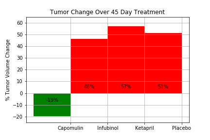
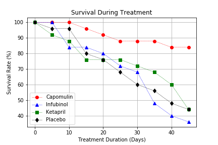
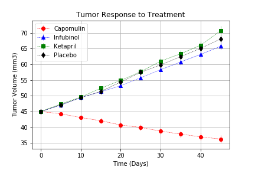
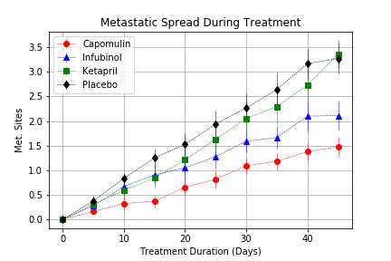

# Matplotlib Challenge - The Power of Plots

## Background
In this study, 250 mice were treated through a variety of drug regimes over the course of 45 days. Their physiological responses were then monitored over the course of that time. 

My objective was to analyze the data to show how four treatments (Capomulin, Infubinol, Ketapril, and Placebo) compare.

The following tasks were completed:

* Creating a scatter plot that shows how the tumor volume changes over time for each treatment.
* Creating a scatter plot that shows how the number of [metastatic](https://en.wikipedia.org/wiki/Metastasis) (cancer spreading) sites changes over time for each treatment.
* Creating a scatter plot that shows the number of mice still alive through the course of treatment (Survival Rate)
* Creating a bar graph that compares the total % tumor volume change for each drug across the full 45 days.
* Include 3 observations about the results of the study. Use the visualizations you generated from the study data as the basis for your observations.

## File to use:
Pymaceutical.ipynb  

## Findings:

Based on the data, the drug Capomulin had the best results for treatment during the 45 days with an overall passing rating.  All the other drugs failed.

Capomulin’s survival rate over the treatment period was close to 100%

Capomulin showed significant shrinkage of the tumor when given while the other two drugs and the Placebo pretty much stayed in line and resulted in tumor growth.

With regards to the cancer metastasizing, Capomulin produced the lowest results of the 3 drugs and the Placebo.  

Infubinol has the worst survival rate over the 45 day treatment period.  However, it did not show a significant increase of tumor growth or metastasizing.  We might want to investigate other factor including long term use with this drug. Ketapril had the worst results scoring higher than the Placebo on both tumor growth and metastatic spreading.

